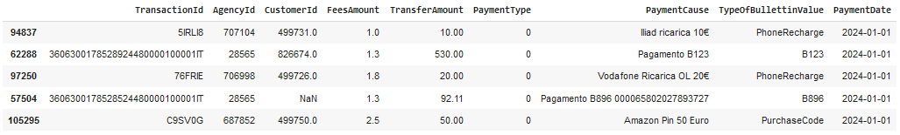
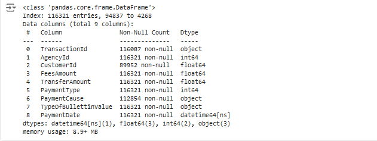
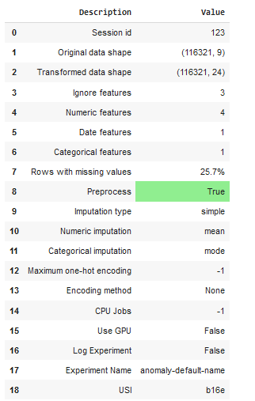
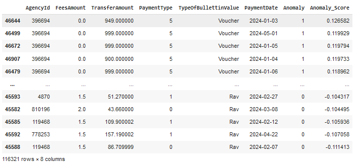
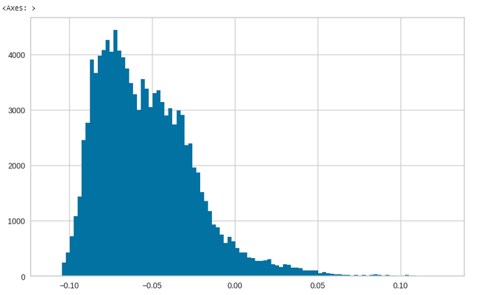
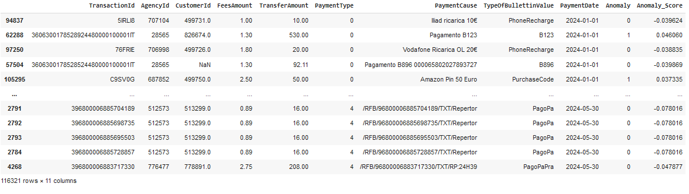

# AML-Machine-Learning
 Combine Unstructured Data  / IForest 

## Step 1: Mount Google Drive (if using Google Drive) 

```Python
from google.colab import drive
drive.mount('/content/drive')
```

## Step 2: Import Necessary Libraries

```Python
import pandas as pd
import glob
import os
from datetime import datetime
import logging
```

### Set up logging

```Python
logging.basicConfig(level=logging.INFO)
logger = logging.getLogger(__name__)
```

## Step 3: Identify CSV Files

```Python
folder_path = '/content/drive/My Drive/Buffetti/Payments'
files = glob.glob(os.path.join(folder_path, '*.csv'))
```

## Step 4: Read and Combine CSV Files

```Python
dfs = []
total_rows = 0
for file in files:
    try:
        df = pd.read_csv(file)
        total_rows += len(df)
        dfs.append(df)
        logger.info(f"Successfully read {file} with {len(df)} rows.")
    except Exception as e:
        logger.error(f"Error reading {file}: {e}")

combined_df = pd.concat(dfs, ignore_index=True)
logger.info(f"Combined DataFrame has {len(combined_df)} rows and {combined_df.shape[1]} columns.")
```

## Step 5: Parse and Sort by Date

```Python
# Step 5: Parse and Sort by Date
def parse_date(date_str):
    for fmt in ("%Y-%m-%d %H:%M:%S", "%Y-%m-%d", "%A, %B %d, %Y"):
        try:
            return datetime.strptime(date_str, fmt)
        except ValueError:
            continue
    logger.error(f"No valid date format found for {date_str}")
    return pd.NaT  # Return NaT for invalid dates
```

## Step 6: Apply the Custom Date Parsing Function

```Python
combined_df['PaymentDate'] = combined_df['PaymentDate'].apply(parse_date)
combined_df.dropna(subset=['PaymentDate'], inplace=True)  # Remove rows with invalid dates
combined_df.sort_values(by='PaymentDate', inplace=True)
```

### Verification

### Check the structure of the combined DataFrame
logger.info(f"First few rows of the combined DataFrame:\n{combined_df.head()}")
logger.info(f"Last few rows of the combined DataFrame:\n{combined_df.tail()}")

### Check for missing values
missing_values = combined_df.isnull().sum()
logger.info(f"Missing values in each column:\n{missing_values}")

### Verify data types
data_types = combined_df.dtypes
logger.info(f"Data types of each column:\n{data_types}")

### Randomly sample a few rows to verify content
sample_rows = combined_df.sample(5)
logger.info(f"Sample rows from the combined DataFrame:\n{sample_rows}")

### Verify the total number of rows
if total_rows == len(combined_df):
    logger.info(f"Row count verification passed: {total_rows} rows in total.")
else:
    logger.error(f"Row count verification failed: {total_rows} rows expected, but got {len(combined_df)} rows.")

### Output the first few rows of the combined DataFrame to visually inspect
combined_df.head() 



```Python
combined_df.shape
```
(116321, 9)

## 7: Installing PyCaret and packages to label Anomaly / Anomaly Score

```Python
pip install pycaret --quiet
```

```Python
import pandas as pd
import datetime
from datetime import timedelta
import plotly.express as px
import numpy as np
```

### Quick check on data types and null values

```Python
combined_df.info()
```



### Determine unique items to eliminate from analysis

```Python
# Count the number of unique items in each column of the DataFrame
unique_counts = combined_df.nunique()

# Print the unique counts
print(unique_counts)
```

### PyCaret Setup

```Python
# Count the number of unique items in each column of the DataFrame
unique_counts = combined_df.nunique()

# Print the unique counts
print(unique_counts)
```



### Create and run model, set at 5%

```Python
model = create_model('iforest', fraction = 0.05)
results = assign_model(model)
results.sort_values(by = 'Anomaly_Score', ascending=False)
```



### Graph Results to view distribution 

```Python
results['Anomaly_Score'].hist(bins=100, figsize =(10,6))
```



### Merge Anomaly and Anomaly_Score to subset

```Python
results_subset = results[['Anomaly', 'Anomaly_Score']]
# Merge the selected columns into 'combined_df' based on the index
combined_results_df = combined_df.join(results_subset
combined_results_df
```



## Step 8: Export Combined DataFrame to CSV

```Python
output_path = '/content/drive/My Drive/Buffetti/Payments/combined_data.csv'  # If using Google Drive

combined_results_df.to_csv(output_path, index=False)
print(f"Combined file saved to: {output_path}")
```

Combined file saved to: /content/drive/My Drive/Buffetti/Payments/combined_data.csv